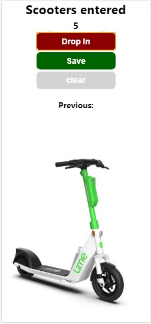

# What for this app
1. This app helps to count scooters that arrive at the warehouse
2. I just have fun while making it
3. That's how I keep my mind in good shape
4. That's how I practice with JS:
- script tag
- variables
- numbers
- strings
- console.log
- functions
- The DOM
- getElementById
- innerText
- textContent

